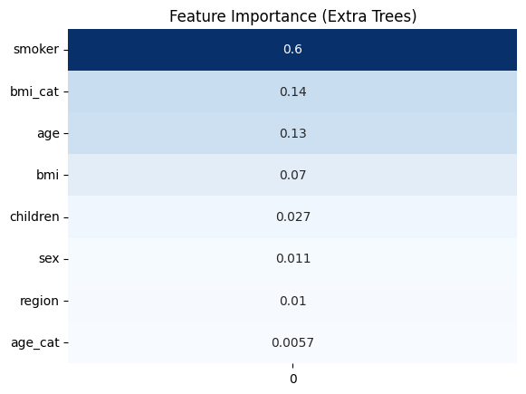

# 🏥 Medical Cost Prediction Using Machine Learning

## Project Overview

Healthcare providers and insurance companies face the challenge of estimating future medical expenses accurately. Incorrect estimates can lead to underpriced insurance policies, poor financial planning, and ineffective risk assessment.

This project uses machine learning techniques to predict medical insurance charges based on customer demographic and lifestyle information. The analysis combines exploratory data analysis, feature engineering, feature selection, and predictive modeling to identify the key drivers of healthcare costs and build an accurate prediction model.

The dataset used in this project is the popular **Insurance Dataset** from Kaggle, containing **1,338 individual insurance records** and information about age, sex, BMI, smoking status, number of dependents, region, and medical charges.

---

# Business Problem

Insurance companies need to estimate future medical expenses before issuing policies and determining premiums.

Without accurate predictions:

- High-risk customers may be underpriced.
- Insurance premiums may not reflect actual risk.
- Financial forecasting becomes difficult.
- Risk management strategies become less effective.

The goal of this project is to build a machine learning model capable of predicting medical insurance costs and identifying the factors that contribute most to healthcare expenses.

---

# Business Objectives

This project aims to answer the following questions:

- Which factors influence medical insurance costs the most?
- How do smoking habits affect healthcare expenses?
- Does age contribute significantly to medical costs?
- What role does BMI play in determining charges?
- Can machine learning accurately predict future medical expenses?
- Which model provides the best predictive performance?

---

# Dataset Information

**Source:** Kaggle Insurance Dataset

**Number of Records:** 1,338

### Features

| Feature | Description |
|----------|-------------|
| age | Age of the insured individual |
| sex | Gender |
| bmi | Body Mass Index |
| children | Number of dependents |
| smoker | Smoking status |
| region | Residential region |
| charges | Medical insurance charges (Target Variable) |

---

# Tools & Technologies

- Python
- Pandas
- NumPy
- Matplotlib
- Seaborn
- Scikit-Learn
- Jupyter Notebook

---

# Project Workflow

## 1. Data Quality Assessment

- Missing value analysis
- Duplicate record investigation
- Data type validation
- Dataset profiling

## 2. Exploratory Data Analysis

Investigated:

- Distribution of medical charges
- Relationship between age and charges
- Impact of smoking status
- BMI and medical costs
- Regional variations
- Gender differences
- Dependents and healthcare expenses

## 3. Feature Engineering

Created:

- BMI Categories
- Age Categories

to improve interpretability and capture additional patterns.

## 4. Feature Selection

Applied:

- Mutual Information
- Extra Trees Feature Importance

to identify the most influential predictors.

## 5. Model Development

Built and compared:

- Linear Regression
- Ridge Regression
- Lasso Regression
- Decision Tree Regressor
- Random Forest Regressor
- Gradient Boosting Regressor

## 6. Model Evaluation

Models were evaluated using:

- R² Score
- Mean Absolute Error (MAE)
- Root Mean Squared Error (RMSE)

---

# Key Visualizations

## Exploratory Analysis


This visualization explores how demographic and lifestyle factors influence medical insurance charges.

---

## Feature Importance



Smoking status, age, and BMI emerged as some of the most influential predictors of medical insurance costs.

---

## Model Comparison


Multiple machine learning algorithms were evaluated to determine which model best predicts medical expenses.

---

## Actual vs Predicted


This plot compares actual medical charges against model predictions and helps assess prediction accuracy and model generalization.

---

# Key Findings

## 1. Smoking Status is the Strongest Predictor

Smokers consistently incurred significantly higher medical expenses than non-smokers.

### Business Implication

Smoking behavior represents a major risk factor and should be considered when assessing insurance premiums and risk exposure.

---

## 2. Age Influences Healthcare Costs

Medical expenses generally increase with age.

### Business Implication

Age can serve as an important indicator when estimating future healthcare costs.

---

## 3. BMI Positively Influences Charges

Higher BMI values tend to be associated with higher medical expenses.

### Business Implication

BMI can help identify individuals who may have elevated healthcare risk.

---

## 4. Region Has Limited Predictive Influence

Compared to smoking status, age, and BMI, regional differences contributed relatively little to overall prediction performance.

### Business Implication

Geographic location alone may not be a strong predictor of medical expenses within this dataset.

---

## 5. Engineered Features Improved Interpretation

BMI categories and age categories simplified the analysis and made patterns easier to understand.

---

# Model Performance

After evaluating multiple machine learning algorithms, the:

## 🌲 Random Forest Regressor

produced the strongest overall performance and was selected as the final model.

### Why Random Forest?

- Captures non-linear relationships.
- Handles interactions between variables effectively.
- Reduces overfitting through ensemble learning.
- Produced superior predictive performance compared to the other models tested.

---

# Business Recommendations

Based on the findings:

### Risk Assessment

- Smoking status should receive significant weighting in risk evaluation frameworks.

### Premium Pricing

- Pricing strategies should account for key drivers such as age, BMI, and smoking behavior.

### Data Collection Improvements

Future models could benefit from additional variables such as:

- Medical history
- Chronic conditions
- Exercise habits
- Occupation
- Income level
- Previous claims history

---

# Project Limitations

The dataset does not include:

- Medical history
- Chronic disease information
- Income levels
- Exercise habits
- Historical insurance claims
- Hospital visitation records

Therefore, the model cannot capture every factor influencing healthcare expenses.

---

# Skills Demonstrated

- Business Understanding
- Data Cleaning
- Exploratory Data Analysis (EDA)
- Feature Engineering
- Feature Selection
- Predictive Modeling
- Model Evaluation
- Machine Learning
- Business Storytelling
- Data Visualization

---

# Repository Structure

```text
Medical-Cost-Prediction/
│
├── README.md
├── Medical Cost Prediction.ipynb
├── insurance.csv
│
├── images/
│   ├── cat vs numerical.png
│   ├── feature_importance.png
│   ├── model evaluation.png
    └── actual vs predicted.png
```

---

## Author

**Joseph Karobio**

Statistics & Probability Student | Data Analyst & Machine Learning Engineer

Passionate about transforming data into actionable insights through statistical analysis, machine learning, and business-focused problem solving.
